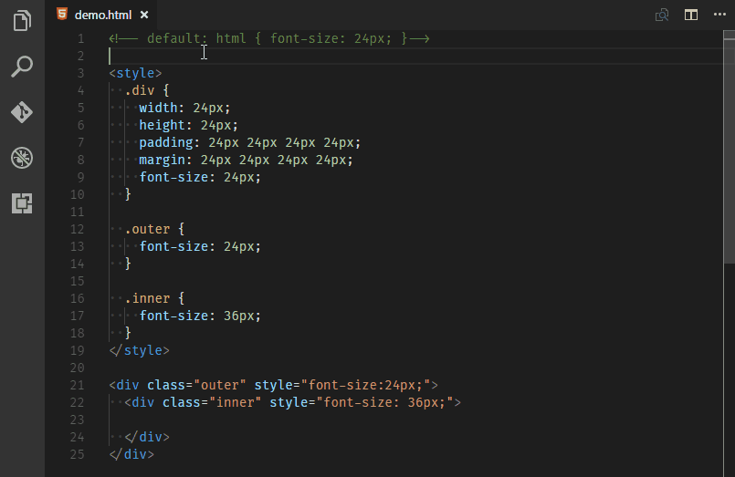

# CSS Unit Converter（px to rem/em）

这是一个小小的 Visaul Studio Code 扩展应用，用于将 `px` 单位的字符串转换为 `rem` 或 `em` 单位的字符串。

## 功能

### 小提示

* 选择文本时，光标有在所要转换的文本方位内即可，无需精确选择
* 可以按住 `alt` 然后依次点击所要转换的数值，一次性选择多个数值，批量转换
* 当转换为 `em` 单位的时候需要输入基准值，单位为 `px` 或 `rem`，`px` 单位是可选的，可以省略

## 安装

目前该插件没有在 VS Code 的扩展市场上架，所以无法直接通过 VS Code 的扩展安装命令在线安装。必须现下载到本地来手动安装。

安装方法非常简单：

1. 在仓库中找到 px2rem-\*.\*.\*.vsix 文件并下载到本地。
1. 打开 VS Code 并在命令面板中输入 `install from vsix` 打开文件选择对话框
1. 选择之前下载的扩展名为vsix的文件即可安装完毕
